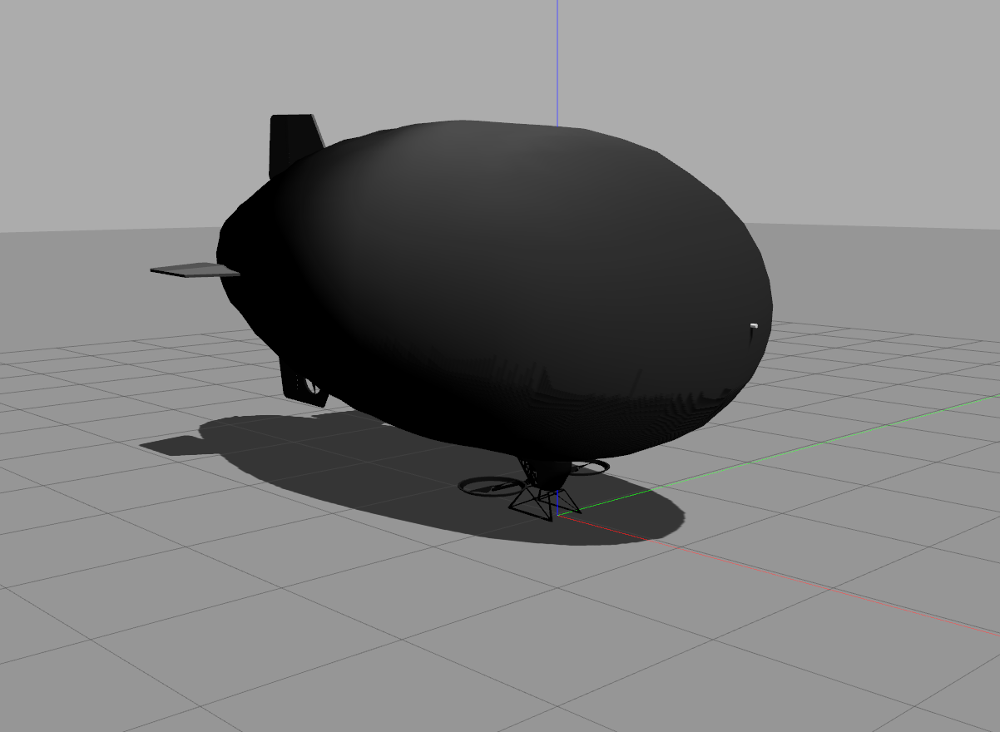

# Autonomous Blimp Control using Deep Reinforcement Learning
=================================================================


# Copyright and License

All Code in this repository - unless otherwise stated in local license or code headers is

Copyright 2021 Max Planck Institute for Intelligent Systems

Licensed under the terms of the GNU General Public Licence (GPL) v3 or higher.
See: https://www.gnu.org/licenses/gpl-3.0.en.html


# Contents

* /RL -- RL agent related files.
* /blimp_env -- training environment of the RL agent. 
* /path_planner -- waypoints assignment.

# Install blimp simulator
see: https://github.com/Ootang2019/airship_simulation/tree/abcdrl


## Configure software-in-the-loop firmware
This step enables ROS control on the firmware.

1. In the firts terminal starts the firmware
```console
cd ~/catkin_ws/src/airship_simulation/LibrePilot
./build/firmware/fw_simposix/fw_simposix.elf 0  
```

2. Start the GCS in the second terminal
```console
cd ~/catkin_ws/src/airship_simulation/LibrePilot
./build/librepilot-gcs_release/bin/librepilot-gcs
```
3. In "Tools" tab (top) --> "options" --> "Environment" --> "General" --> check "Expert Mode" --> restart
4. Select "Connections" (bottom right) --> UDP: localhost --> Click "Connect"
5. "Configuration" tab (bottom) --> "Input" tab (left) --> "Arming Setting" --> Change "Always Armed" to "Always Disarmed" --> Click "Apply"
6. "HITL" tab --> click "Start" --> check "GCS Control". 
   This will disarm the firmware and allow to save the configuration
7. "Configuration" tab --> "Input" tab (left) --> "Flight Mode Switch Settings" --> Change "Flight Mode"/"Pos. 1" from "Manual" to "ROSControlled" 
8. "Configuration" tab --> "Input" tab (left) --> "Arming Setting" --> Change "Always Disarmed" to "Always Armed" --> Click "Save" --> Click "Apply" 
9. Confirm the change by restarting firmware, connecting via gcs, and checking if "Flight Mode"/"Pos. 1" is "ROSControlled"

# Install RL training environment

In the same catkin_ws as airship_simulation: 

1. setup bimp_env
```console
cd ~/catkin_ws/src
git clone -b master https://github.com/robot-perception-group/robust_deep_residual_blimp.git
cd ~/catkin_ws/src/AutonomousBlimpDRL/blimp_env
pip install .
```
2. setup RL agent
```console
cd ~/catkin_ws/src/AutonomousBlimpDRL/RL
pip install .
```

3. compile ROS packages
```console
cd ~/catkin_ws
catkin_make
source ~/catkin_ws/devel/setup.bash
```

4. (optional) export path to .bashrc

Sometimes it is not able to find the package because of the setuptools versions. In this case, we have to manually setup the environment path.
```console
echo 'export PYTHONPATH=$PYTHONPATH:$HOME/catkin_ws/src/AutonomousBlimpDRL/blimp_env/:$HOME/catkin_ws/src/AutonomousBlimpDRL/RL/' >> ~/.bashrc
source ~/.bashrc
```

# Start Training (Blimp Simulator)
Open file in ~/catkin_ws/src/AutonomousBlimpDRL/RL/rl/rlyang_script/main.py, set PID to True if training with the PID controller, else set it to False.

One agent will be trained for one day. In terminal, start the training progress
```console
python3 ~/catkin_ws/src/AutonomousBlimpDRL/RL/rl/rlyang_script/main.py
```


Viualize (Blimp Simulator)
* Gazebo. In new terminal, start gzcilent
```console
gzcilent
```
* rviz. In new terminal, start rviz and load a configured rviz flie
```console
rosrun rviz rviz -d ~/catkin_ws/src/AutonomousBlimpDRL/blimp_env/blimp_env/envs/rviz/planar_goal_env.rviz
```

To close the simulation
```console
. ~/catkin_ws/src/AutonomousBlimpDRL/blimp_env/blimp_env/envs/script/cleanup.sh
```


# Reproduction of results (Blimp Simulator)

--------------
## Test: Coil track run with different buoyancy, wind and agent-controller combinations
--------------
```console
python3 ~/catkin_ws/src/AutonomousBlimpDRL/RL/rl/rlyang_script/test.py
```


# Start Training (TurtleSim Simulator)
First start 8 TurtleSim simulators
```console
roslaunch turtlebot multi.launch
```

Open a new terminal. Then train 12 agents using 3 seeds per group (group 1: PID, q=0; group 2: Hinf, q=0; group 3: PID, q ~ Normal(0, 1); 
group 4: Hinf, q ~ Normal(0, 1).)  
```console
python3 ~/catkin_ws/src/turtlebot/scripts/RL.py
```

# Reproduction of results (TurtleSim Simulator)

--------------
## Test: Plant input disturbance will be enhanced by 5 times and 100 turtles per test are to be caught
```console
python3 ~/catkin_ws/src/turtlebot/scripts/test.py
```

# Cite
```
@ARTICLE{2022arXiv220305360T,
       author = {{Tang Liu}, Yu and {Price}, Eric and {Black}, Michael J. and {Ahmad}, Aamir},
        title = "{Deep Residual Reinforcement Learning based Autonomous Blimp Control}",
      journal = {arXiv e-prints},
         year = 2022,
}
```

previous work (git branch v1.0)
```
@article{Liu2021ABCDRL,
  title={Autonomous Blimp Control using Deep Reinforcement Learning},
  author={Yu Tang Liu, Eric Price, Pascal Goldschmid, Michael J. Black, Aamir Ahmad},
  journal={arXiv preprint arXiv:2109.10719},
  year={2021}
}
```
